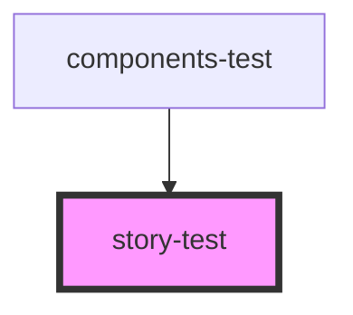

# story-test

<!-- Auto Generated Below -->

## Properties

| Property | Attribute | Description            | Type                                       | Default     |
| -------- | --------- | ---------------------- | ------------------------------------------ | ----------- |
| `color`  | `color`   | Color of the component | `Color.Green \| Color.Orange \| Color.Red` | `Color.Red` |
| `text`   | `text`    | Text to display        | `string`                                   | `''`        |

## Events

| Event          | Description                                 | Type               |
| -------------- | ------------------------------------------- | ------------------ |
| `clickEventBy` | Event emitted by the component when clicked | `CustomEvent<any>` |

## Dependencies

### Used by

 - [components-test](../components-test)

### Graph

----------------------------------------------

*Built with [StencilJS](https://stenciljs.com/)*
